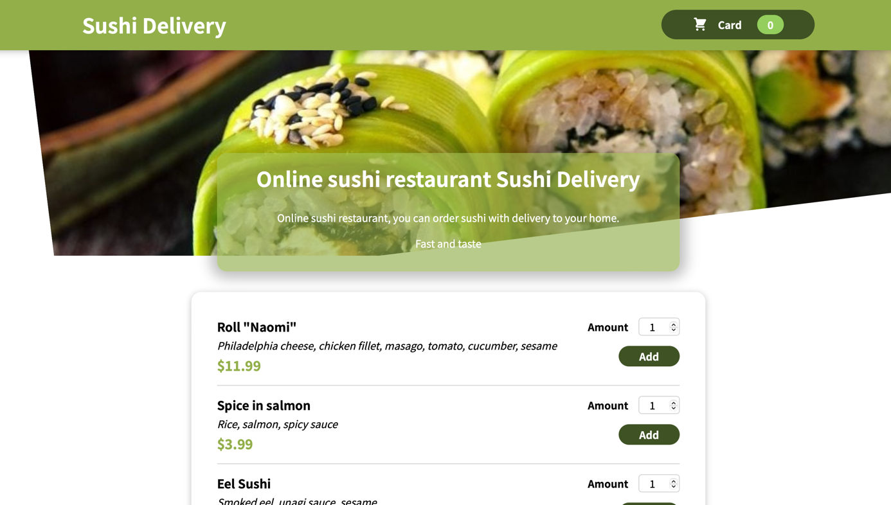

# Educational project to learn React

Project is created to practice development React applications.

This is the simple online store application with product and cart. 
The user can add and delete products from cart, open and edit the cart

## To run the application

run the next command from the root of project:

### `npm install`

and then

### `npm start`

Open [http://localhost:3000](http://localhost:3000) to view it in your browser.

